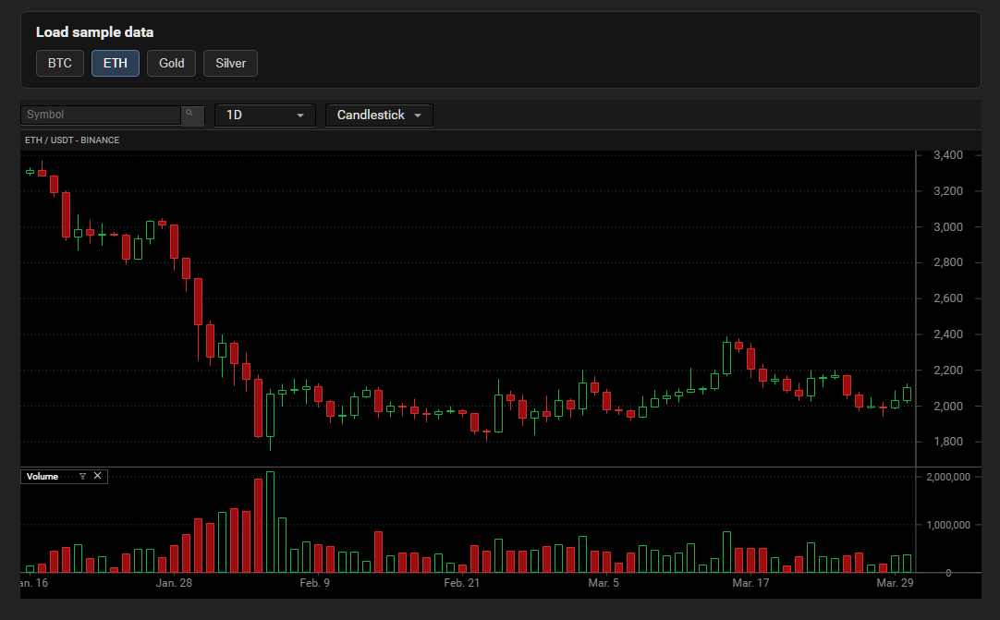

# JDCharts

JDCharts is a JavaScript charting library for financial market data.



## Usage

```js
import JDCharts from 'jdcharts';
import type { ChartData } from 'jdcharts';

const jd = new JDCharts();
const chart = jd.createChart(options);

chart.setData(myChartData as ChartData);
await chart.updateChart();
```

## Scripts

```bash
git clone https://github.com/ljdcodes/jdcharts.git
npm install
npm run build
npm run preview
```
